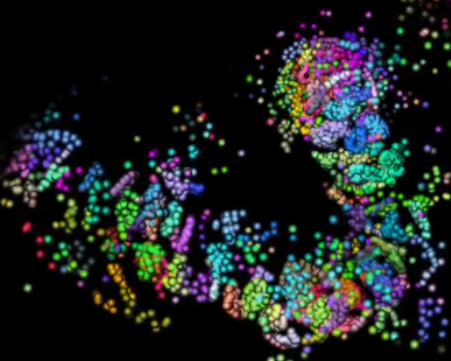

# Genetic Particle Life
A GPU-accelerated 3D particle-life experiment about bottom-up emergent structure. 
Particles carry abstract genomes that shape local attraction, repulsion, drift, and divergence, letting clusters form, split, recombine, and organize into larger organism-like structures.

# Features
12,000 particles in 3D, simulated with ModernGL compute shaders

Abstract genomes that influence particle interactions and visual identity

Local clustering, genome drift, divergence, and density-center cohesion

Interaction-based opacity so dense active structures are easier to see

Free-flying camera for inspecting emergent forms from any angle

# Running From Source
Install the Python dependencies:
pip install pygame moderngl numpy

Run the simulation:
python GeneticParticleLife.py

# Screenshot

